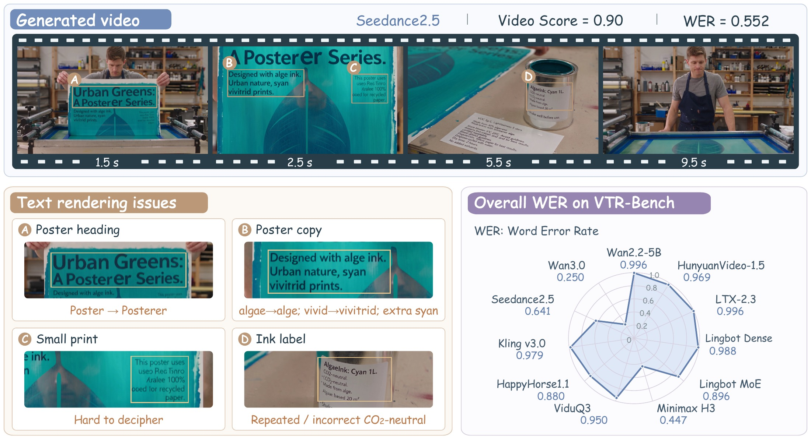

<div align="center">
  <h1>VTR-Bench</h1>
  <h3>A Systematic Benchmark for Evaluating Visual Text Rendering in Video Generation</h3>
  <p>
    <a href="https://huggingface.co/datasets/hardenyu/VTR-Bench">🤗 Dataset &amp; Videos</a>
    &nbsp; | &nbsp;
    <a href="#main-results">📊 Results</a>
    &nbsp; | &nbsp;
    <a href="#evaluation">🔎 Evaluation</a>
    &nbsp; | &nbsp;
    <a href="#agentic-generation">🎬 Agentic Generation</a>
  </p>
  <p><b>300 prompts · 5 application scenarios · 1,202 text blocks · 11 video generation models</b></p>
</div>

## Overview

**Can video generation models render the required text accurately?** A convincing
scene can still contain misspelled words, unreadable passages, or legible but
incorrect information. VTR-Bench evaluates whether generated videos faithfully
reproduce the text specified by users, from short labels to extended passages
embedded in advertisements, scientific demonstrations, interfaces, and everyday
activities.

<p align="center">
  
</p>

VTR-Bench brings together:

- **Text rendering in context.** Expert-guided construction and human review
  produce 300 prompts with explicit textual content, carrier descriptions, and
  scene requirements across five application scenarios.
- **Automated evaluation with human alignments.** Carrier-specific transcription
  measures text fidelity, while a prompt-specific **chain of query (CoQ)**
  independently measures fulfillment of scene and motion requirements.
- **Keyframe-Guided Agentic Generation.** A Director agent coordinates image and
  video generation with visual inspection, iterative refinement, and candidate
  selection to improve the fidelity of generated text.

## Benchmark

Each scenario contains **60 prompts**. Every prompt has **20 binary questions**,
for a total of **6,000 CoQ questions** and **1,202 required-text blocks**.

| Scenario | Case prefix | Prompts |
| :--- | :---: | ---: |
| Advertisement | `AD` | 60 |
| Science | `SCI` | 60 |
| User Interface | `UI` | 60 |
| Culture | `CULT` | 60 |
| Daily Life | `LIFE` | 60 |

### Data and generated videos

The final annotations are bundled with this repository:

| File | Contents |
| :--- | :--- |
| [prompts.json](vtr_bench/data/prompts.json) | Case IDs, English generation prompts, scene metadata, text carriers, and reference text. |
| [checklists.json](vtr_bench/data/checklists.json) | The 20 CoQ questions for each prompt, with their evaluation dimensions. |

Generate videos using `prompt_en`; the reference text and CoQ annotations are
used for evaluation. Generated videos and experiment collections are hosted on
[Hugging Face](https://huggingface.co/datasets/hardenyu/VTR-Bench/tree/main/generated_videos).
The HF repository is currently private and requires access. The annotations
above are available directly in this GitHub repository.

## Main Results

**Visual text rendering remains challenging across current video generation
models.** The strongest model achieves an overall WER of 0.250, while models with
similar Video Scores can differ substantially in text fidelity. VTR-Bench
captures this distinction by assessing the written content separately from the
surrounding scene and motion requirements.

The following results use **Qwen3.8-27B** as the evaluator and **α = 5** for WER.
Video Score is the proportion of satisfied CoQ requirements; WER measures errors
against the required text. Both metrics are reported on a 0–1 scale.

| Model | Type | Resolution | WER ↓ | Video Score ↑ |
| :--- | :--- | :---: | ---: | ---: |
| Wan2.2-5B | Open-source | 1280 × 704 | 0.996 | 0.436 |
| HunyuanVideo-1.5 | Open-source | 1280 × 720 | 0.969 | 0.601 |
| LTX-2.3 | Open-source | 768 × 512 | 0.996 | 0.607 |
| Lingbot-Video-Dense | Open-source | 832 × 480 | 0.988 | 0.534 |
| Lingbot-Video-MOE | Open-source | 832 × 480 | 0.896 | 0.549 |
| Minimax H3 | Open-source | 1344 × 768 | 0.447 | 0.756 |
| ViduQ3 | Proprietary | 1280 × 720 | 0.950 | 0.786 |
| HappyHorse1.1 | Proprietary | 1280 × 720 | 0.880 | 0.831 |
| Kling v3.0 | Proprietary | 1280 × 720 | 0.979 | 0.793 |
| Seedance2.5 | Proprietary | 1280 × 720 | 0.641 | 0.791 |
| Wan3.0 | Proprietary | 1280 × 720 | **0.250** | **0.849** |

## Getting Started

```bash
git clone https://github.com/hardenyu21/VTR-Bench.git
cd VTR-Bench
```

The reference runtimes use **Linux, Python 3.12, NVIDIA GPUs**, and
`ffmpeg` / `ffprobe` on `PATH`. Install evaluation and generation in separate
Python environments because they use different vLLM versions. Model checkpoints
and API credentials are supplied by the user.

## Evaluation

The evaluation pipeline computes two complementary metrics:

| Metric | What it measures | How it is evaluated |
| :--- | :--- | :--- |
| **Video Score ↑** | Fulfillment of video requirements | A VLM answers the prompt's 20 CoQ questions with yes/no judgments. |
| **WER ↓** | Fidelity of the rendered text | A VLM transcribes text from specified carriers without seeing the reference strings; the transcription is compared with the reference text using the benchmark tokenizer. |

CoQ questions cover **Scene Attributes, Motion Adherence, Spatial Relationship,
Entity Presence, and Temporal Consistency** as applicable. A prompt does not need
to include all five dimensions. Dimension scores aggregate only the questions
assigned to that dimension.

### 1. Set up the evaluator

Prepare a local **Qwen3.8-27B** checkpoint, the evaluator used for the main
results. **Qwen3.6-27B** is also supported.

```bash
python3.12 -m venv .venv-eval
source .venv-eval/bin/activate
python -m pip install -e . -r requirements/evaluation.txt
export VTR_EVALUATOR_MODEL=/path/to/evaluator-checkpoint
```

### 2. Evaluate your videos

Place MP4s directly in a model's video folder and name them by benchmark case ID,
for example `AD-0001.mp4`. The command matches these filenames to the bundled
annotations and runs both metrics:

```bash
vtr-bench evaluate /path/to/videos
```

To evaluate a single video or choose an output directory:

```bash
vtr-bench evaluate /path/to/AD-0001.mp4 --output /path/to/results
```

Partial collections are supported. Missing IDs are reported and excluded from
scoring; unknown or duplicate IDs are rejected. Compatible existing runs resume
automatically. Use `--dry-run` to check the inputs without loading the evaluator.

### 3. Read the results

Results are saved to `results/<input-name>/metrics.json` by default, with per-case
outputs and logs in `details/`.

- **Video Score:** reported under `checklist` as `yes_rate`, with overall,
  scenario-level, and dimension-level scores.
- **WER:** reported under `wer` as `case_balanced_wer`, with `R+1`, `R+5`, and
  `R+10` settings. Here, `R` is the reference token count and `α` is the number of
  additional hypothesis tokens allowed. **Use `R+5` to match the main results.**
  Case scores are bounded to `[0, 1]` and averaged equally across videos.

<details>
<summary><b>Reference evaluation settings</b></summary>

The evaluator uses BF16, tensor parallelism of 1, 2-FPS video sampling,
non-thinking mode, and at most three attempts per case. The pinned runtime is
specified in [requirements/evaluation.txt](requirements/evaluation.txt).

</details>

## Agentic Generation

The **Keyframe-Guided Agentic Framework** turns a generation prompt into a video
through visual feedback. Its **Director agent** chooses the next action and its
instructions at each stage:

1. **Construct a first frame.** Write an image prompt, generate candidate images,
   and inspect their text, carriers, and scene content. Refine the image prompt,
   edit an existing image, or generate new candidates before selecting a frame.
2. **Plan the motion.** Specify actions, camera movement, and temporal progression.
   The video generator receives the selected first frame together with the
   **original prompt and an additive motion plan**.
3. **Review and refine the video.** Inspect and compare video candidates, revise
   motion guidance based on visual feedback, and select the final video.

On **Minimax H3**, the full framework reduces overall WER by **32.5%** relative to
direct generation while improving Video Score:

| Generation setting | WER ↓ | Video Score ↑ |
| :--- | ---: | ---: |
| Direct generation | 0.4468 | 0.7562 |
| I2V | 0.3328 | 0.8132 |
| **Agentic** | **0.3015** | **0.8315** |

I2V uses the original prompt and the **first image generated in the corresponding
Agentic run**. The conditioning frame is removed from both I2V and Agentic videos
before evaluation. Results use Qwen3.8-27B and the `R+5` WER setting.

### 1. Configure the models

| Role | Reference model |
| :--- | :--- |
| Director agent and visual reviewer | Qwen3.7-plus |
| Image generator and editor | Qwen-Image-3.0 |
| Video generator | Minimax H3 |

Prepare the MiniMax-H3 FL2VA checkpoint at
`/path/to/models/MiniMax-H3/FL2VA`. The reference video service uses **four GPUs**
with sufficient memory and disables CPU offload by default.

```bash
python3.12 -m venv .venv-gen
source .venv-gen/bin/activate
python -m pip install -e . -r requirements/generation-reference.txt
export VTR_BENCH_PROJECT_ROOT="$PWD"
export VTEXTBENCH_MODELS_ROOT=/path/to/models
export BAILIAN_API_KEY=YOUR_KEY
export BAILIAN_BASE_URL=https://YOUR_WORKSPACE.cn-beijing.maas.aliyuncs.com/compatible-mode/v1
export VLLM_WORKER_MULTIPROC_METHOD=spawn
```

Use an API endpoint with access to the configured chat and image models. See
[.env.example](.env.example) for available settings. Export the variables in each
shell; `.env.example` is not loaded automatically.

### 2. Start the video generator

```bash
CUDA_VISIBLE_DEVICES=0,1,2,3 vtr-bench agentic --serve
```

Keep this process running. After loading, the service is available at
`http://127.0.0.1:18123`. It processes requests through a shared H3 engine and
should remain bound to loopback because it has no network authentication.

### 3. Generate videos

In another shell, enter the repository, activate `.venv-gen`, and export the same
configuration. Run one case, or omit the ID to process all 300 prompts:

```bash
vtr-bench agentic --case-id AD-0001
vtr-bench agentic
```

Final videos are saved to
`generated_videos/experiments/agentic/final_videos/<ID>.mp4`. Each case also retains
image and video candidates, visual feedback, and the Director agent's decisions.

<details>
<summary><b>Generation settings and outputs</b></summary>

The default output is **1344 × 768, 24 FPS, and 10 seconds**, with seed 42.
The video generator produces 241 frames; the conditioning frame is discarded,
leaving 240 frames. Audio is trimmed by the same 1/24-second offset.

The default exploration limits are 20 actions, 30 API calls, and three video
generations. A fallback can generate an additional candidate when exploration
does not finalize a video; this is recorded in the case outputs.

For non-agentic baseline generation, see the official
[vLLM-Omni recipes](https://github.com/vllm-project/vllm-omni/tree/main/recipes).

</details>

## Acknowledgements

Our implementation builds on [vLLM-Omni](https://github.com/vllm-project/vllm-omni)
and [Qwen-Image](https://github.com/QwenLM/Qwen-Image). We thank their developers
and the teams behind the evaluated video generation models.

## License

The code is released under the [Apache-2.0 License](LICENSE). External models,
datasets, and dependencies retain their respective licenses and terms.
